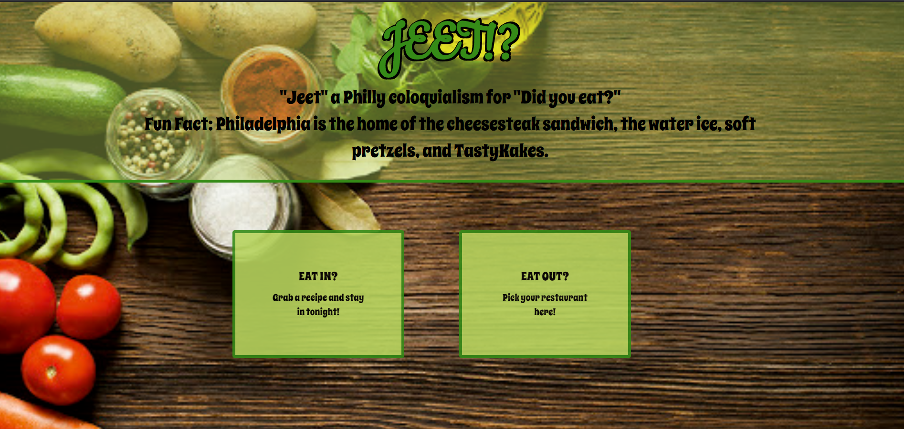

# The-Greatest-Group
Project
HEY! LOOK AT MY CHANGES!
## yeah, we see it. 

JEET!?

https://kdacanay.github.io/The-Greatest-Group/

**JEET!?**

Project Requirements:

* Use at least two APIS
* Use Ajax to pull data
* Use at least one new library or technology that we haven't discussed
* Create a polished front end/UI
* Meet good quality coding standards (indentation, scoping, naming, etc.)
* Do not use alerts, confirms, or prompts (look into modals)
* Incorporate some sort of repeating elemtn (table, columns, etc)
* Use bootstrap or an alternative CSS framework
* Deploy to Github
* Include user input validation

  Our group's idea is derived from multiple ideas after much discussion.  We decided on a scenario that plays out in many relationships: deciding what to eat.  To begin, we display our title screen, where the user simply decides to eat in or eat out.  After clicking their choice, they are brought to the appropriate page.  The Eat In page displays default ideas for different recipes, such as Italian food, Mexican or Chinese food, etc.  Or the user can input an additional recipe topic, like chicken parmagiana. After using AJAX to call the Spoonacular API, 25 recipes are displayed amongst three columns.  The recipe cards are animated through the screen using an additional JS library called Bounce.js.  After clicking an image, a modal appears with a recipe summary displayed.  Additional links like similar recipes are also included.  Similarly, the eat out page takes the users preferred city and a food they wish to have.  We use AJAX to call the zomato API, where it takes the users city input and displays all the restaurants related to the chosen food topic, also located in the city requested.  After clicking a restaurant card, the user is taken to the attached zomato website displaying the restaurants hours, menu, etc.  

